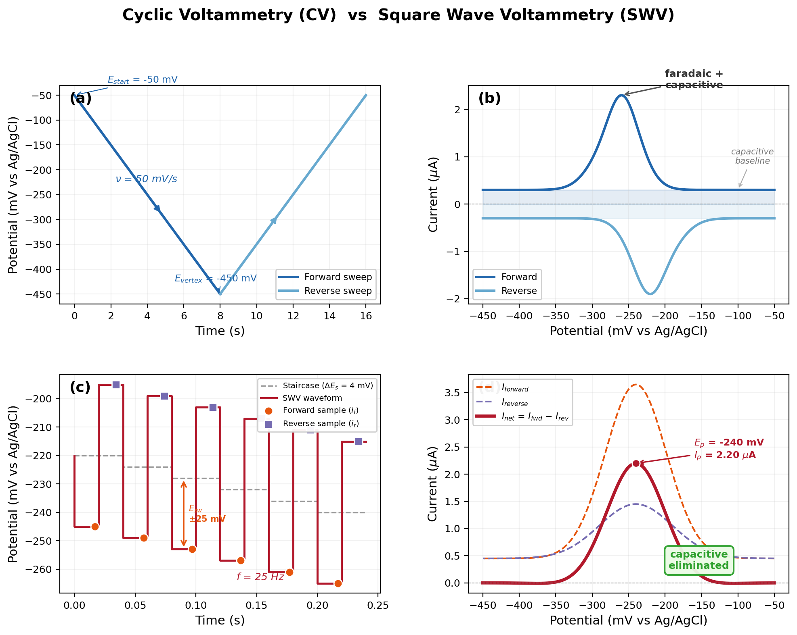
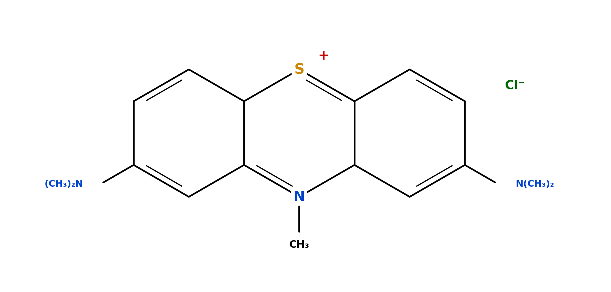
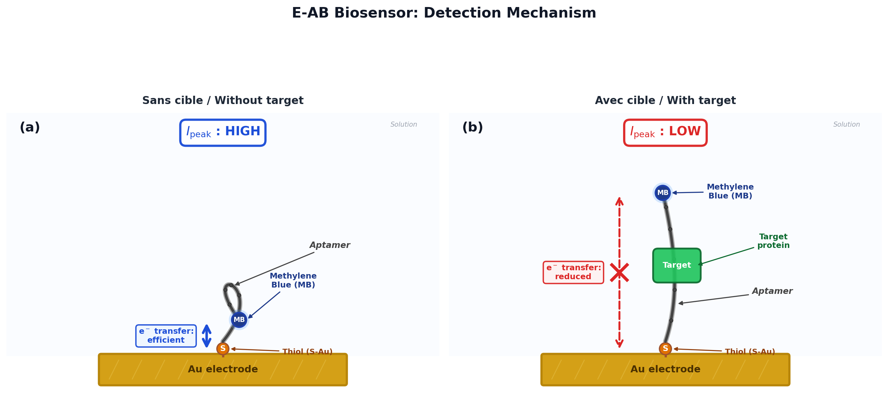

Electrochemical aptamer-based biosensors rely on measuring a redox signal to detect target molecules in real time. The sensor is interrogated using square wave voltammetry (SWV), a pulsed technique offering significantly higher sensitivity and signal-to-noise ratio than conventional cyclic voltammetry (CV).

This page presents the SWV principle, the redox reporter used (methylene blue) and the quantitative metrics extracted from the voltammogram. These metrics form the analytical basis for the three parametric studies in this application.

**Contents:**
1. Principle of square wave voltammetry
2. Methylene blue peak
3. Metrics extracted from the voltammogram
4. Metrics summary table

---

## 1. Principle of square wave voltammetry

### 1.1 Why SWV rather than CV?

Cyclic voltammetry (CV) is the most common electrochemical technique, but it mixes faradaic current (useful signal) and capacitive current (background noise). SWV solves this problem by subtracting two current measurements taken at symmetric instants, thereby eliminating the capacitive component. In practice, SWV achieves detection limits 10 to 100 times lower than CV.

### 1.2 Waveform

Square Wave Voltammetry (SWV) superimposes two signals onto the working potential:

1. **Staircase**: potential increment $\delta E_s = 4$ mV at each cycle.
2. **Symmetric pulses**: amplitude $\pm\,\delta E_p = 25$ mV around each step.

At each staircase step, a positive (*forward*) pulse followed by a negative (*reverse*) pulse is applied. The current is sampled at the end of each pulse, when the capacitive current has decayed exponentially.

### 1.3 Net current

The net current is defined by:

$$I_{net} = I_{forward} - I_{reverse}$$

This subtraction greatly reduces the capacitive component (double-layer charging current), which is nearly identical in magnitude for both symmetric pulses. Only the faradaic current, proportional to the concentration of the electroactive species, is retained. SWV thus provides a significantly better signal-to-noise ratio than CV.

### 1.4 Typical parameters

| Parameter | Symbol | Typical value |
|-----------|--------|---------------|
| Potential increment | $\delta E_s$ | 4 mV |
| Pulse amplitude | $\delta E_p$ | 25 mV |
| Frequency | $f$ | 10 -- 500 Hz |
| Initial potential | $E_{start}$ | −0.05 V |
| Final potential | $E_{end}$ | −0.45 V |

---

## 2. Methylene blue peak

### 2.1 Redox reporter

Methylene blue (MB) is a cationic dye from the **phenothiazine** family, widely used as a redox reporter in E-AB biosensors. Its structure comprises:

- a **tricyclic phenothiazine core**: two benzene rings fused to a central thiazine ring containing a sulfur atom (S) and a nitrogen atom (N);
- two **dimethylamino** groups —N(CH₃)₂ at positions 3 and 7, responsible for the blue colour;
- a **permanent positive charge** delocalised across the conjugated aromatic system (thiazinium cation), stabilised by resonance through the tricyclic core.

> Molecular formula: C₁₆H₁₈N₃S⁺ (cation) · Cl⁻ (counter-ion) — molar mass: 319.85 g/mol.

MB is covalently conjugated to the distal end (5') of the aptamer, which itself is anchored to the gold electrode surface via a thiol bond (3' end).

### 2.2 Redox reaction

The methylene blue redox reaction involves two electrons and two protons:

$$\text{MB}_{ox} + 2e^- + 2H^+ \rightleftharpoons \text{MB}_{red}$$

The current peak is centred around the apparent standard potential:

$$E^0 = -0.24 \text{ V vs Ag/AgCl} \quad (\text{pH } 7.4, \text{ PBS buffer})$$

The potential $E^0$ depends on pH according to the Nernst equation: a shift of approximately $-59$ mV per pH unit at 25 °C for a process involving equal numbers of protons and electrons.

### 2.3 Detection mechanism

#### Aptamer conformation

An aptamer is a single-stranded DNA oligonucleotide (typically 25 to 50 nucleotides for E-AB biosensors) whose **conformation** — i.e. its three-dimensional spatial arrangement — is governed by:

- **intramolecular base pairing** (Watson-Crick hydrogen bonds: A-T, G-C), forming secondary structures (stems, loops, junctions);
- **π-π base stacking** between adjacent nucleobases, stabilising helical segments;
- **electrostatic repulsion** between phosphate backbone groups, partially screened by counter-ions (Na⁺, K⁺, Mg²⁺).

On the electrode surface, the aptamer does not adopt a fixed conformation but instead explores a dynamic **conformational ensemble**, described statistically by a Boltzmann distribution. It is the **time-averaged** MB-to-surface distance that determines the electron transfer efficiency.

#### E-AB probe architecture

| Component | Detail |
|-----------|--------|
| **Anchoring** | 3'-end modified with a C6-thiol linker (HS-(CH₂)₆-) forming a covalent Au-S bond (~170 kJ/mol) |
| **Redox reporter** | 5'-end (distal) covalently labelled with methylene blue (MB) |
| **Backfill** | Self-assembled monolayer (SAM) of 6-mercapto-1-hexanol (MCH) displacing non-specifically adsorbed DNA and forcing aptamers into an upright orientation via dipolar repulsion between the MCH -OH terminus and the negatively charged DNA backbone |

The optimal probe density is of the order of $10^{12}$ probes/cm², achieved by tuning the aptamer-to-MCH molar ratio (typically 1:100).

#### Target binding and conformational switching

Detection relies on a **structure-switching** mechanism: the aptamer has a pre-formed secondary structure that is destabilised by target binding. The resulting complex is stabilised by a combination of non-covalent forces: hydrogen bonds, electrostatic interactions, van der Waals forces, the hydrophobic effect, and π-π stacking.

For a ***signal-off*** biosensor (the most common configuration with MB):

1. **Without target**: the aptamer forms a compact stem-loop (hairpin) structure. MB, bound to the 5'-end, is held **close** to the surface (MB-to-surface distance $d \approx 1$–$2$ nm).
2. **With target**: the target binds to the aptamer, destabilising the stem. The aptamer unfolds into a more extended conformation, moving MB **away** from the surface ($d \approx 5$–$10$ nm).

> *Note: other E-AB architectures operate in **signal-on** mode, where target binding brings MB closer to the surface (induced fit mechanism). The choice of mode depends on the aptamer sequence and probe design.*

#### Exponential distance dependence of electron transfer

The heterogeneous electron transfer rate constant $k_{ET}$ between MB and the gold electrode follows an **exponential decay** with distance, governed by quantum-mechanical tunnelling:

$$k_{ET} = k_0 \cdot \exp(-\beta \cdot d)$$

where $k_0$ is the pre-exponential factor at contact ($\sim 10^6$–$10^8$ s⁻¹ for a C6 thiol linker on gold), $\beta$ is the tunnelling decay constant, and $d$ is the MB-to-surface distance in ångströms.

For the **ordered alkanethiol linker** (SAM), $\beta \approx 0.9$–$1.1$ Å⁻¹ (through-bond tunnelling). However, for transfer through the **flexible aptamer structure** (single-stranded DNA in solution), the mechanism is more complex (through-solvent transfer, hopping) and the effective $\beta$ is significantly lower ($\approx 0.1$–$0.4$ Å⁻¹).

This exponential dependence means that a conformational change displacing MB from $d \approx 15$ Å (folded) to $d \approx 60$ Å (unfolded) produces a typical peak current decrease of **30 to 80%**, which is amply sufficient for quantitative measurement.

#### From molecular binding to the SWV voltammogram

The complete signal transduction chain is as follows:

1. The **target** binds to the aptamer (affinity characterised by $K_d \sim$ nM–µM).
2. The **conformational change** moves MB away from the gold surface.
3. The electron transfer rate constant $k_{ET}$ **decreases** (exponential decay with distance).
4. During SWV interrogation, both forward and reverse currents decrease, leading to a **reduction of the net current** $I_{net}$.
5. The relative signal change $\Delta I / I_0 = (I_{target} - I_0) / I_0 < 0$ is **proportional to the target concentration**, following a Langmuir isotherm:

$$\frac{\Delta I}{I_0} = \left(\frac{\Delta I}{I_0}\right)_{max} \cdot \frac{[\text{Target}]}{K_d + [\text{Target}]}$$

---

## 3. Metrics extracted from the voltammogram

### 3.1 $I_{peak}$ -- peak current (nA)

The maximum amplitude of the faradaic peak after baseline subtraction. In the reversible regime, directly proportional to:

- The surface density of electroactive aptamers $\Gamma_{eff}$ (mol/cm²)
- The SWV frequency $f$ (Hz) — linearity decreases in the quasi-reversible regime
- The square of the number of electrons exchanged ($n^2$, with $n = 2$ for MB)

### 3.2 $E_{peak}$ -- peak potential (V)

The potential at which the net current reaches its maximum. For a reversible system, $E_{peak} \approx E^0$. A shift from the expected value ($-0.24$ V) may indicate:

- Uncompensated resistance (ohmic shift $IR$)
- A change in local environment (pH, ionic strength)
- Kinetic effects at high frequency

### 3.3 FWHM -- full width at half maximum (mV)

The total width at half maximum of the SWV peak. For an ideal Nernstian surface-adsorbed system with $n$ electrons, the theoretical limit (derived from the Nernst-Langmuir equation, used as a reference for SWV) is:

$$\text{FWHM}_{ref} = \frac{3.53\,RT}{nF} = \frac{90.6}{n} \text{ mV} \quad (25\,°\text{C})$$

For methylene blue ($n = 2$): $\text{FWHM}_{ref} \approx 45.3$ mV. In SWV, the peak width also depends on the pulse amplitude $\delta E_p$. Broadening beyond this reference value indicates quasi-reversible kinetics, surface heterogeneity, or uncompensated resistance.

### 3.4 SNR -- signal-to-noise ratio

$$\text{SNR} = \frac{I_{peak}}{\sigma_{residuals}}$$

An SNR $> 10$ is generally required for reliable quantitative measurement. An SNR $> 50$ is considered excellent.

### 3.5 $I_{baseline}$ -- baseline current (µA)

The background current measured away from the faradaic peak, reflecting the residual capacitive contribution and parasitic currents after SWV subtraction. Proportional to the real electrode surface area through the double-layer capacitance ($C_{dl} \propto \text{RF}$).

### 3.6 $IR_{drop}$ -- ohmic drop (mV)

$$IR_{drop} = I_{peak} \times R_u$$

This shift moves the peak toward more negative potentials and broadens it. At nanoampere-level currents and with $R_u < 100\;\Omega$, the $IR_{drop}$ generally remains negligible ($< 1$ mV).

### 3.7 $K$ -- dimensionless kinetic parameter

$$K = \frac{k^0_{eff}}{f}$$

where $k^0_{eff}$ is the effective electron transfer rate constant (s⁻¹) and $f$ the SWV frequency (Hz).

| Regime | Value of $K$ | Behaviour |
|--------|--------------|-----------|
| Reversible | $K > 5$ | Sharp peak, $E_{peak} = E^0$ |
| Quasi-reversible | $0.1 < K < 5$ | Broadened peak, $E_{peak}$ shifts |
| Irreversible | $K < 0.1$ | Very broad peak, reduced current |

For aptamer biosensors with MB, $k^0_{eff}$ is typically in the range of 10 to 100 s⁻¹, placing the system in the quasi-reversible regime at typical SWV frequencies (25--200 Hz).

---

## 4. Metrics summary table

| Metric | Symbol | Unit | Typical value (25 Hz, clean electrode) | Sensitive to |
|--------|--------|------|----------------------------------------|--------------|
| Peak current | $I_{peak}$ | nA | 30 -- 80 | RF, Ni, contamination, $f$ |
| Peak potential | $E_{peak}$ | V | −0.24 | $R_u$, $f$ (high), Ni |
| Width at half max | FWHM | mV | 45 -- 60 | $f$, $R_u$, Ni |
| Signal-to-noise ratio | SNR | — | 50 -- 200 | Ni (dominant), RF, contamination |
| Baseline current | $I_{baseline}$ | µA | 0.1 -- 1.0 | RF ($\propto$ RF) |
| Ohmic drop | $IR_{drop}$ | mV | < 0.1 | $R_u$, RF × $R_u$ |
| Kinetic parameter | $K$ | — | 0.2 -- 4.0 | $f$, Ni (via $k^0_{eff}$) |
